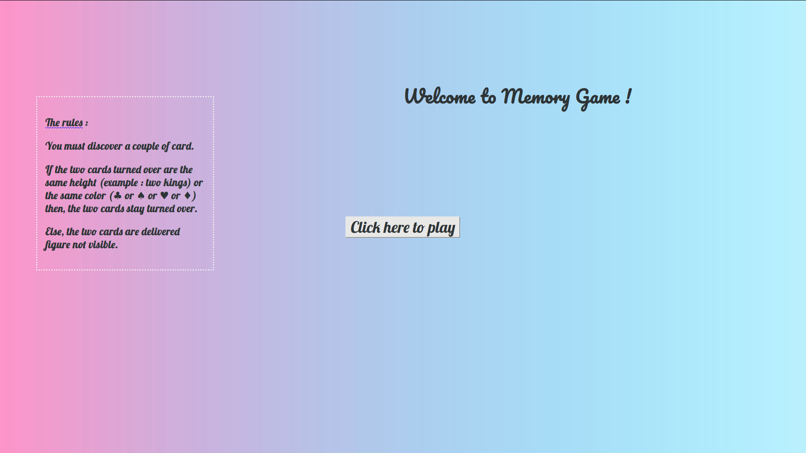
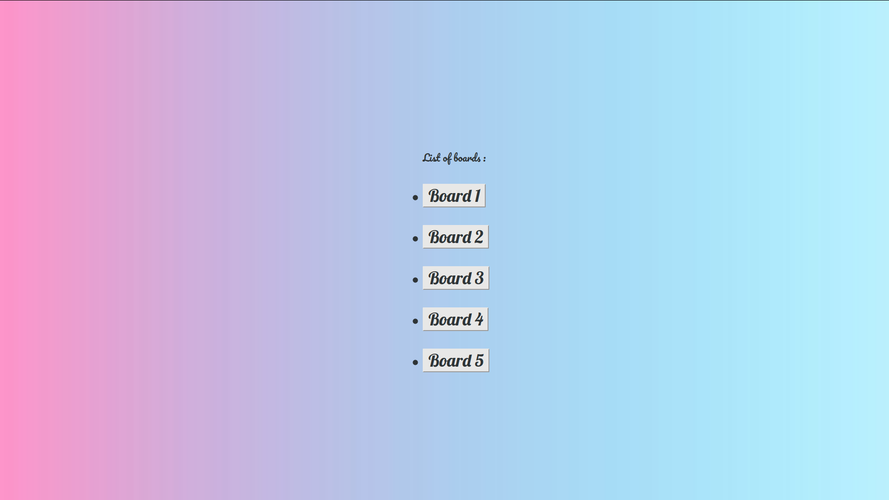
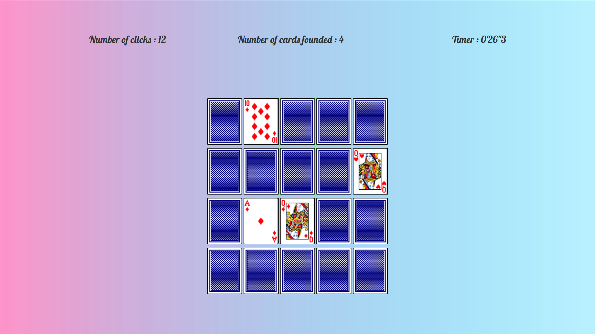

# Memory Card

This project is the game of Memory Card. 

I did it in 2020, during my 3th year of university license. This is a school project, and is developed in JavaScript and Ajax. This project is finished.

## Rules
You must discover a couple of card.

If the two cards turned over are the same height (example : two kings) or the same color (♣ or ♠ or ♥ or ♦) then, the two cards stay turned over.

Else, the two cards are delivered figure not visible. 

## To begin
Do the command :  `$ git clone https://github.com/debroucker/memory_card.git` to recover this repository.

## Prerequisite
You need to have a server, to put the files in it.

## Start-up
Add the files on your server, lunch `memory.html` in your server, and enjoy.

## Made with
Visual Studio Code

## Authors
DEBROUCKER Tommy
